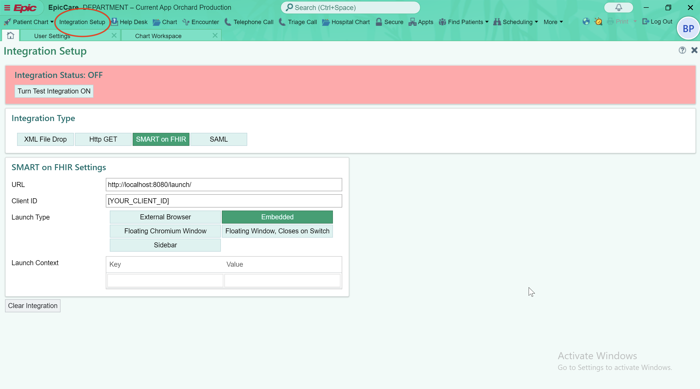
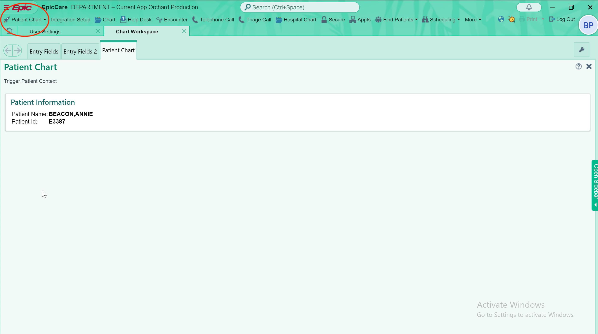

# Summary

This application is meant to serve as an example for the FHIR authentication process. Through the information in this README and the code in the [relevant files](#relevant-files), you may observe the authentication process as well as how to request Epic resources.

## Before You Begin

Before you begin, you must install the following dependencies on your machine:

1. [Hyperdrive Client Testing Harness](https://open.epic.com/Hyperdrive/HyperdriveDownload) (Windows Only)

   - Since the testing harness is Windows only, you should install these dependencies on a Windows machine.

2. [Node](https://nodejs.org/en/download) (>=18.18.1)

3. [Java 17](https://www.oracle.com/java/technologies/javase/jdk17-archive-downloads.html)

4. [Apache Maven](https://maven.apache.org/download.cgi)

## Relevant Files

#### Frontend

- app.tsx: Defines routes for web application
- launch.tsx: Page that is intended to be rendered first during an EHR launch. In Epic Hyperdrive, you should enter the URL of this page during setup. This file also contains the authentication logic.
- main.tsx: Page that is intended to be rendered after the authentication process, once Epic redirects. This file also contains the logic for obtaining the access token, passing the access token to the backend, and using the backend to request Epic resources.
- constants.ts: Defines constant variables used in this project. **Replace `CLIENT_ID` and `REDIRECT_URI` with your own information.**

#### Backend

- EpicResource.java: Defines endpoints frontend queries to access Epic resources.
- SecurityConfiguration.java: Defines security configuration for the project.

## Register Your Application with Epic

1. Sign up for [Vendor Services](https://vendorservices.epic.com/).
2. Once signed in, select "Manage Apps" -> "My Apps."
3. Select "Create" or select an existing application.
4. Name your app, and select who will be using it. Since this example is developed for EHR use, we have selected "Clinicians, Staff, or Administrative Users."
5. Select the features you need. For this example, we only need to select "Incoming API" to gain access to Epic resources.
6. Select all the APIs you plan on using. _Note: there are 3 types of APIs (DSTU2, STU3, and R4). It does not matter which you select, but your app must make calls to the API corresponding to its FHIR version (see next steps)_
7. Toggle on "Use OAuth 2.0" and select an App FHIR version.
8. Add the URLs of each page of your app in the "Endpoint URI" section. In the case of this example, I have added `http://localhost:8080/` and `http://localhost:8080/launch/`
9. Click "Save."

## Testing Your Application in Hyperdrive Client Testing Harness

Most likely, the buttons mentioned here will not appear on the top navigation bar. If that is the case, select "More" on the top navigation bar to find the appropriate buttons. You can even drag them around and reorder them so they stay on the top navigation bar.

After request access credentials from Epic and logging into Hyperdrive:

#### Integration Setup

1. Click on "Integration Setup" as circled in the screenshot above.
2. Select "Smart on FHIR" as the Integration Type.
3. Enter the launch URL into the field labeled "URL." This will be the first screen that appears when the application is started.
4. Enter the Client ID into the field labled "Client ID." This can be found on your app's page on [Vendor Services](https://vendorservices.epic.com/). Since we are working within the testing harness, this will be the non-production Client ID.
5. Select whichever type of Launch Type you prefer. The most useful ones I have found are "External Browser" and "Embedded." By clicking "External Browser," your application opens in a web browser. This has allowed me to use Chrome's Developer Tools when debugging during development. By clicking "Embedded," you application launches directly within Hyperdrive, which is useful if you want to see how your application would look within the EHR.
6. Click "Turn Test Integration ON," and proceed to [Patient Chart](#patient-chart)

#### Patient Chart

1. Click on "Patient Chart" as circled in the screenshot above.
2. Click on "Patient Chart" and double-click to select a patient when prompted.
3. Click "Trigger Patient Context," and your application will start with the selected patient as the patient (this will affect the patient ID returned by the token endpoint).

## Authentication Flow

1. Epic launches your application in Hyperdrive using the launch URL specified in [Integration Setup](#integration-setup) and appends two query prameters: `iss` and `launch`.
2. Your application makes a `GET` request to a URL formed by concatenating `iss` with the string `/metadata`.
3. Your application parses the response to retrieve both the URLs for the authentication endpoint and the token endpoint.
4. Your application authenticates by redirecting to a URL formed by concatenating the following query paramters with the authentication URL received in the previous step:
   - `scope`: set to `launch` for EHR launches
   - `response_type`: set to `code`
   - `redirect_uri`: the URI for the page Epic will redirect to after authenticating. _Note: this page must also be registered on [Vendor Services](https://vendorservices.epic.com/)._
   - `client_id`: the Client ID retrieved from your application's page on [Vendor Services](https://vendorservices.epic.com/) (the non-production version while testing)
   - `launch`: the launch code retrieved from the `launch` query parameter.
   - `aud`: set to `iss`, retrieved from the query parameter.
5. Epic authenticates and redirects the application to the `redirect_uri` and appends a query parameter: `code`.
6. Your application retrieves an access token by sending a `POST` request to the token endpoint (from Step 3) and appends the following query parameters:

   - `grant_type`: set to `authorization_code`
   - `redirect_uri`: set to the same value as `redirect_uri` mentioned in Step 4
   - `code`: the code retrieved from the `code` query parameter
   - `client_id`: the Client ID retrieved from your application's page on [Vendor Services](https://vendorservices.epic.com/) (the non-production version while testing)

   _Note: The request must contain the header: `Content-Type': 'application/x-www-form-urlencoded`._

7. Now you can access any of the APIs selected when you set up your application by sending an HTTP request to the correct endpoint and attaching the header `Authorization: Bearer [token]`, where `[token]` is the `access_token` returned from the token endpoint.

## Using Epic APIs

As mentioned previously, you request epic resources by sending an HTTP request to the correct endpoint and attaching the header `Authorization: Bearer [token]`, where `[token]` is the `access_token` returned from the token endpoint. While we pass the token to the backend and make the requests there in this example, you may also make these requests from the frontend.

Epic's [documentation](https://fhir.epic.com/Specifications) should provide all the information necessary on how to use their APIs.

**IMPORTANT: the base URL for all requests will be the value of the `iss` query parameter obtained during the [Authentication Flow](#authentication-flow).**

## Other Important Information

- Make sure to replace `CLIENT_ID` and `REDIRECT_URI` in constants.ts with your own information.
- The web application is run within an iframe in Hyperdrive. This means that iframing must be enabled within your security configuration. This project has allowed iframing by disabling the `X-Frame-Options` and `Content-Security-Policy: frame ancestors` headers. A good place to test if your application allows iframing is [W3Schools' Iframe Tryit Page](https://www.w3schools.com/tags/tryit.asp?filename=tryhtml_iframe).
- After updating your application information on [Vendor Services](https://vendorservices.epic.com/), updates often take 20-30 minutes to sync.
- The following patients have genomic data available:
  1. Annie Beacon
  2. Henry Clin Doc

## Running the project

`./mvnw`
